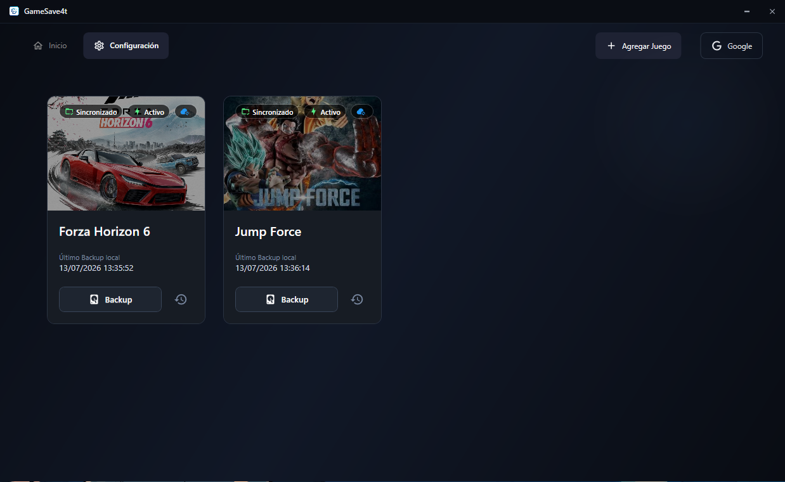

<h1 align="center">
  <b>¡Hola! Soy Yasel David Muñoz</b> 
  
</h1>

  

---

### 👨‍💻 Sobre mí

Desarrollador de Software enfocado en la construcción de **aplicaciones web, APIs RESTful y sistemas de gestión empresarial**. Cuento con experiencia sólida en el stack **C# / .NET**, **React**, **Next.js** y **PostgreSQL**.

He participado en proyectos completos end-to-end: desde el diseño de la base de datos hasta el despliegue en servidores **Linux y Windows** usando **Docker**. Además, implemento flujos de trabajo eficientes mediante automatización de procesos con **n8n** e integración de **agentes de IA**.

---

### 🛠️ Habilidades Técnicas

  <b>Backend & APIs:</b> 
  
  
  
  
  

  <b>Frontend:</b> 
  
  
  
  
  
  
  
  

  <b>Bases de Datos:</b> 
  
  
  
  

  <b>DevOps, Servidores & Herramientas:</b> 
  
  
  
  
  
  

  <b>Automatización e IA:</b> 
  
  

---

### Proyectos Destacados

<table>
  <tr>
    <td width="50%" align="center">
      <h3><b>Fundación UNCAF RD</b></h3>
      
      
Plataforma web institucional para mejorar la presencia digital y atención comunitaria.

      
<b>Tecnologías:</b>

      
        
      <a href="https://funcaf.org/" target="_blank">🌐 Ver sitio web</a>
    </td>
    <td width="50%" align="center">
      <h3><b>GameSave4t</b></h3>
      
      
Aplicación de escritorio para respaldos automáticos de partidas y sincronización en Google Drive.

      
<b>Tecnologías:</b>

      
        
      <a href="https://github.com/4temix/GameSave4tbeta" target="_blank">📁 Ver Repositorio</a>
    </td>
  </tr>

  <tr>
    <td width="50%" align="center">
      <h3><b>Purificadora HY</b></h3>
      
      
Página web corporativa y adaptativa para comercialización de agua purificada.

      
<b>Tecnologías:</b>

      
        
      <a href="https://4temix.github.io/purificadora_web/" target="_blank">🌐 Ver Demo</a>
    </td>
    <td width="50%" align="center">
      <h3><b>Fundación UNCAF RD (En actualización)</b></h3>
      
      
Rediseño y migración full stack con arquitectura moderna y backend optimizado.

      
<b>Tecnologías:</b>

      
        
      <a href="https://funcafdm.uk/" target="_blank">🌐 Ver sitio web</a>
    </td>
  </tr>

  <tr>
    <td width="50%" align="center">
      <h3><b>Próximo Proyecto...</b></h3>
       
      
🤖 Actualmente desarrollando soluciones empresariales escalables integrando <b>Agentes de IA y flujos de n8n</b>.

    </td>
    <td width="50%" align="center">
    </td>
  </tr>
</table>

---

### 📬 ¡Conectemos!

  
  

 

  <i>"Sé tú mismo"</i> 

